# 多人在线联机关卡挑战系统设计文档

## 1. 概述

本文档设计了一个基于现有Vue贪吃蛇游戏的多人在线联机关卡挑战系统，旨在通过引入多人实时对战、渐进式关卡设计和多样化挑战机制，显著提升游戏的难度和趣味性。

### 1.1 系统目标
- 实现多人在线实时对战功能
- 设计渐进式关卡挑战系统  
- 增加游戏机制的多样性和策略性
- 提供完整的社交功能和排行榜系统
- 保持良好的用户体验和游戏平衡性

### 1.2 核心价值
- **竞技性**: 多人实时对战增强竞争体验
- **成长性**: 关卡系统提供持续进步动力
- **社交性**: 好友系统和团队合作增强互动
- **多样性**: 丰富的游戏模式和挑战类型

## 2. 技术架构

### 2.1 整体架构设计

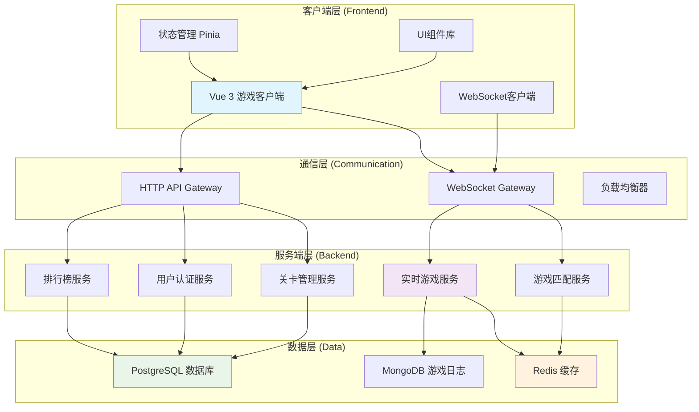

### 2.2 技术栈升级

| 层级 | 技术选型 | 说明 |
|------|----------|------|
| 前端框架 | Vue 3 + Composition API | 保持现有技术栈 |
| 状态管理 | Pinia | 替换本地状态，支持复杂状态管理 |
| 实时通信 | WebSocket + Socket.io | 支持多人实时交互 |
| 后端框架 | Node.js + Express | 与前端技术栈统一 |
| 数据库 | PostgreSQL + Redis | 关系型数据 + 缓存 |
| 部署平台 | Docker + K8s | 支持弹性扩展 |

### 2.3 数据流架构

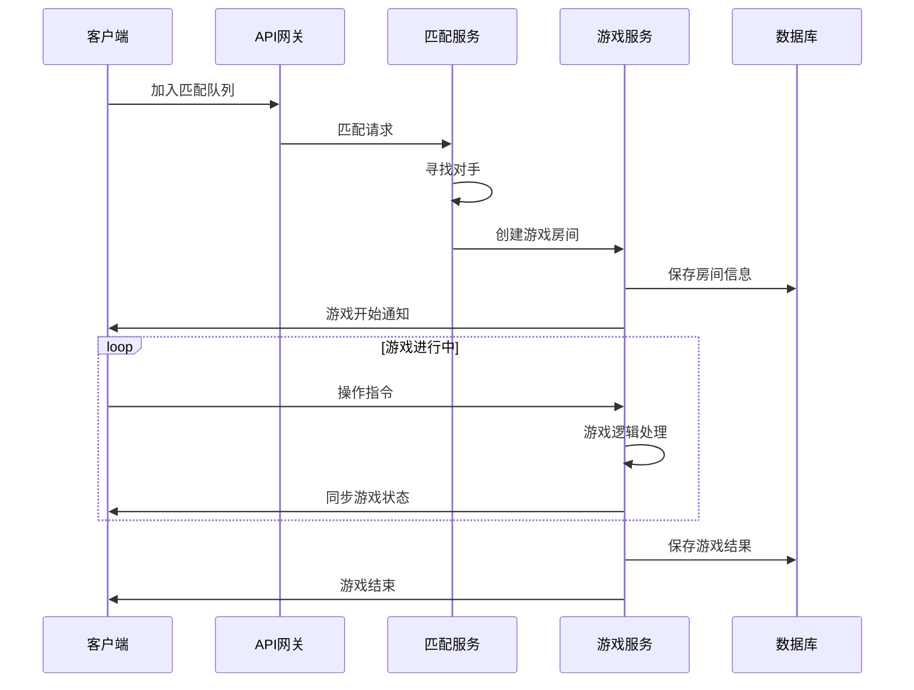

## 3. 功能设计

### 3.1 多人联机系统

#### 3.1.1 匹配机制设计

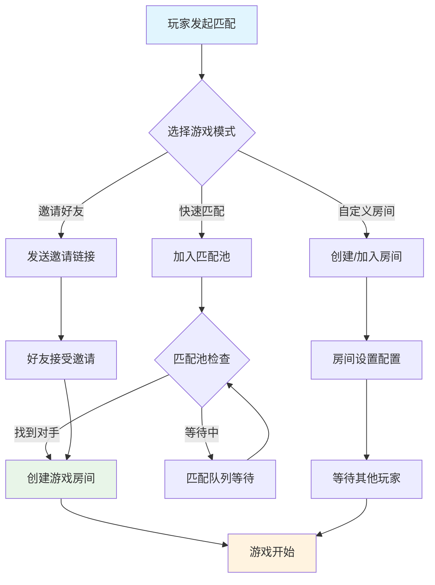

#### 3.1.2 游戏模式类型

| 模式名称 | 玩家数量 | 游戏机制 | 胜利条件 |
|----------|----------|----------|----------|
| 经典对战 | 2-4人 | 同屏竞技，碰撞淘汰 | 最后存活者胜利 |
| 团队合作 | 2-6人 | 协作完成关卡目标 | 达成团队目标 |
| 积分竞赛 | 2-8人 | 限时内比拼得分 | 积分最高者胜利 |
| 生存挑战 | 1-4人 | 波次怪物挑战 | 存活指定轮次 |

#### 3.1.3 实时同步机制

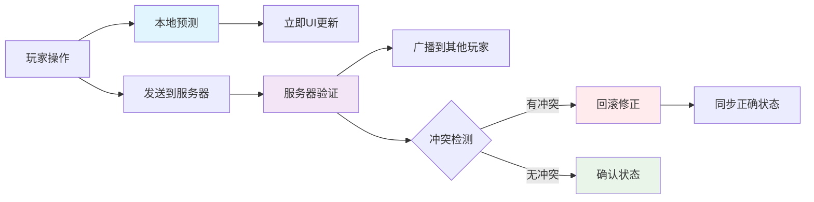

### 3.2 关卡挑战系统

#### 3.2.1 关卡设计架构

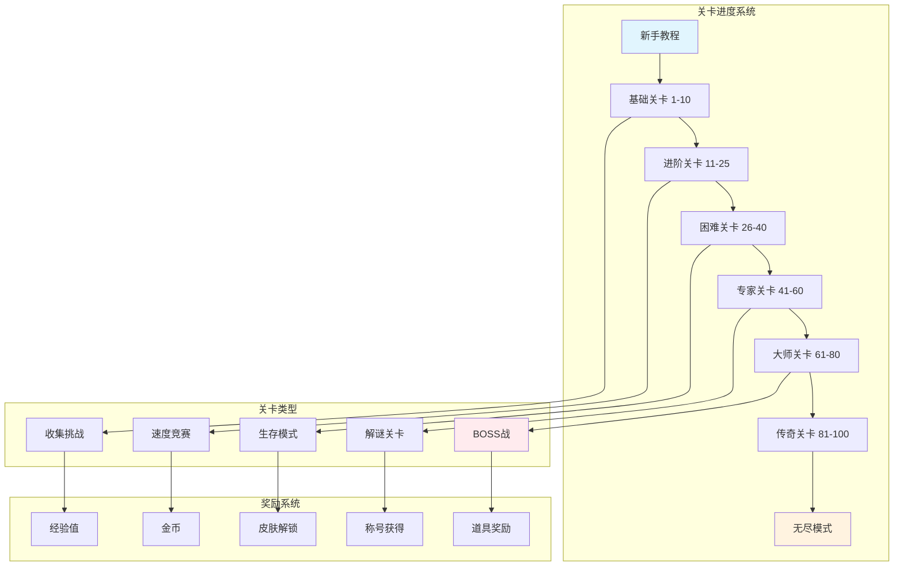

#### 3.2.2 关卡难度设计

| 关卡段位 | 速度倍率 | 障碍物密度 | 特殊机制 | 解锁条件 |
|----------|----------|------------|----------|----------|
| 新手(1-10) | 0.8x | 低(5-10%) | 基础移动 | 无 |
| 基础(11-25) | 1.0x | 中(10-20%) | 特殊食物 | 通关前段 |
| 进阶(26-40) | 1.2x | 中高(20-30%) | 传送门 | 三星通关 |
| 困难(41-60) | 1.5x | 高(30-40%) | 时间限制 | 段位达成 |
| 专家(61-80) | 1.8x | 极高(40-50%) | 多重机制 | 排行榜前50% |
| 大师(81-100) | 2.0x | 随机变化 | 动态地图 | 精英玩家 |

#### 3.2.3 特殊关卡机制

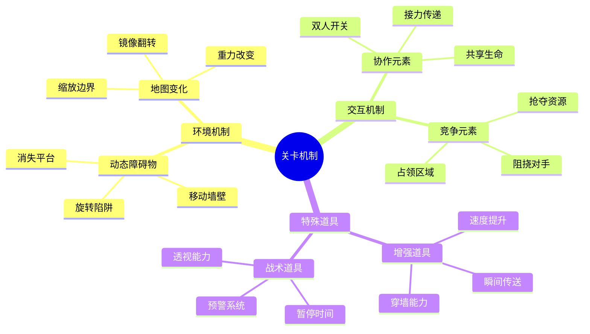

### 3.3 游戏机制增强

#### 3.3.1 技能系统设计

| 技能类别 | 技能名称 | 效果描述 | 冷却时间 | 获得方式 |
|----------|----------|----------|----------|----------|
| 移动技能 | 瞬间冲刺 | 快速移动3格距离 | 15秒 | 关卡15解锁 |
| 防御技能 | 护盾保护 | 免疫一次碰撞伤害 | 30秒 | 关卡25解锁 |
| 攻击技能 | 激光斩击 | 穿透障碍物直线攻击 | 45秒 | 关卡35解锁 |
| 辅助技能 | 时间减缓 | 周围环境速度减半 | 60秒 | 关卡45解锁 |

#### 3.3.2 装备系统

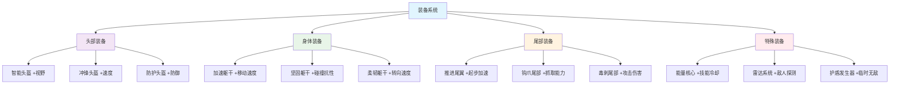

#### 3.3.3 元素交互系统

| 元素类型 | 视觉表现 | 效果机制 | 交互规则 |
|----------|----------|----------|----------|
| 火焰墙 | 红色火焰动画 | 接触造成伤害 | 可用冰系技能熄灭 |
| 冰霜地面 | 蓝色冰晶纹理 | 移动速度减半 | 可用火系技能融化 |
| 电力网格 | 黄色闪电特效 | 暂时麻痹控制 | 可用绝缘装备免疫 |
| 磁力场 | 紫色波纹扩散 | 改变移动方向 | 金属装备受影响更大 |

## 4. 数据模型设计

### 4.1 核心数据结构

#### 4.1.1 用户数据模型

```typescript
interface User {
  id: string;
  username: string;
  email: string;
  avatar: string;
  level: number;
  experience: number;
  totalGames: number;
  wins: number;
  losses: number;
  ranking: number;
  achievements: string[];
  unlockContent: UnlockContent;
  settings: UserSettings;
  createdAt: Date;
  lastActiveAt: Date;
}

interface UnlockContent {
  skins: string[];
  skills: string[];
  equipment: string[];
  levels: number[];
  gameMode: string[];
}

interface UserSettings {
  soundVolume: number;
  musicVolume: number;
  graphics: 'low' | 'medium' | 'high';
  controls: ControlMapping;
  language: string;
}
```

#### 4.1.2 游戏房间模型

```typescript
interface GameRoom {
  id: string;
  hostId: string;
  gameMode: GameMode;
  levelId?: string;
  maxPlayers: number;
  currentPlayers: Player[];
  gameState: GameState;
  roomSettings: RoomSettings;
  createdAt: Date;
  startedAt?: Date;
  endedAt?: Date;
}

interface GameState {
  status: 'waiting' | 'starting' | 'playing' | 'paused' | 'finished';
  currentLevel: number;
  timeElapsed: number;
  gameData: {
    gridSize: number;
    obstacles: Position[];
    foods: FoodItem[];
    powerUps: PowerUp[];
  };
  playerStates: Map<string, PlayerGameState>;
}

interface PlayerGameState {
  playerId: string;
  snake: Position[];
  direction: Direction;
  score: number;
  isAlive: boolean;
  activePowerUps: ActivePowerUp[];
  equipment: EquipmentSet;
}
```

#### 4.1.3 关卡数据模型

```typescript
interface Level {
  id: string;
  name: string;
  description: string;
  difficulty: DifficultyLevel;
  category: LevelCategory;
  unlockConditions: UnlockCondition[];
  objectives: Objective[];
  environment: EnvironmentConfig;
  rewards: Reward[];
  timeLimit?: number;
  maxAttempts?: number;
}

interface EnvironmentConfig {
  gridSize: number;
  obstacles: ObstaclePattern[];
  specialElements: SpecialElement[];
  dynamicEvents: DynamicEvent[];
  backgroundTheme: string;
  musicTrack: string;
}

interface Objective {
  type: 'score' | 'survival' | 'collection' | 'speed' | 'cooperation';
  target: number;
  description: string;
  isRequired: boolean;
  reward: Reward;
}
```

### 4.2 数据存储策略

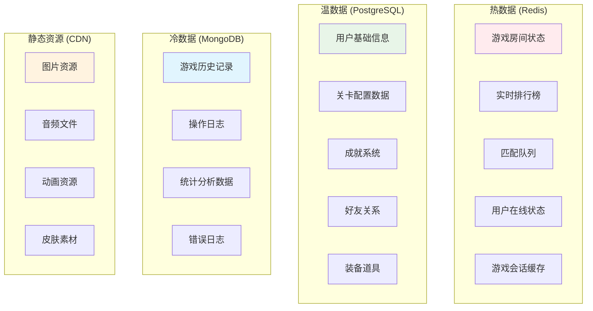

## 5. UI/UX设计

### 5.1 界面布局重构

#### 5.1.1 主界面设计

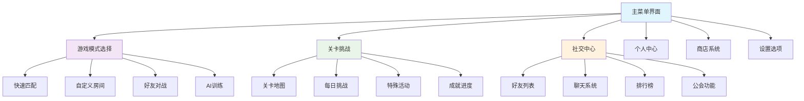

#### 5.1.2 游戏内UI优化

| UI元素 | 位置 | 功能描述 | 交互方式 |
|--------|------|----------|----------|
| 小地图 | 右上角 | 显示全局视野 | 点击跳转视角 |
| 技能栏 | 下方中央 | 展示可用技能 | 快捷键或触摸 |
| 聊天窗口 | 左下角 | 团队通讯 | 文字/语音输入 |
| 状态面板 | 左上角 | 生命值/能量 | 实时数值显示 |
| 计分板 | 右下角 | 实时排名 | 展开详细信息 |

#### 5.1.3 响应式设计适配

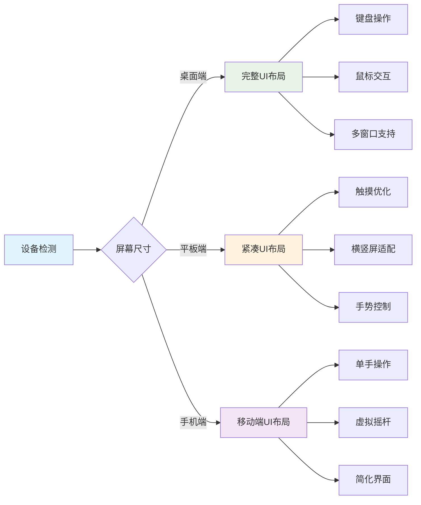

### 5.2 游戏体验优化

#### 5.2.1 视觉反馈系统

| 反馈类型 | 触发条件 | 效果表现 | 持续时间 |
|----------|----------|----------|----------|
| 成功击杀 | 消灭对手 | 金色光环+音效 | 2秒 |
| 技能释放 | 使用技能 | 特效动画+震屏 | 1秒 |
| 关卡完成 | 达成目标 | 烟花效果+胜利音乐 | 3秒 |
| 受到伤害 | 碰撞损血 | 红色闪烁+警告音 | 0.5秒 |
| 获得道具 | 拾取物品 | 光芒收集+提示音 | 1秒 |

#### 5.2.2 动画和特效

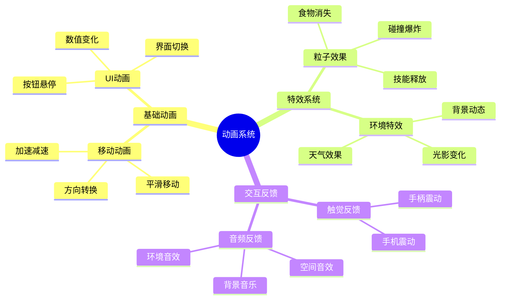

## 6. 测试策略

### 6.1 多人游戏测试

#### 6.1.1 网络测试场景

| 测试场景 | 模拟条件 | 预期结果 | 验收标准 |
|----------|----------|----------|----------|
| 网络延迟测试 | 50-300ms延迟 | 游戏仍可正常进行 | 延迟<200ms时体验流畅 |
| 丢包测试 | 1-5%丢包率 | 自动重连和同步 | 丢包<3%时无明显卡顿 |
| 断线重连 | 网络中断5-30秒 | 自动重连成功 | 30秒内重连成功率>95% |
| 并发压力 | 1000+同时在线 | 服务器稳定运行 | CPU<80%, 内存<90% |

#### 6.1.2 游戏逻辑测试

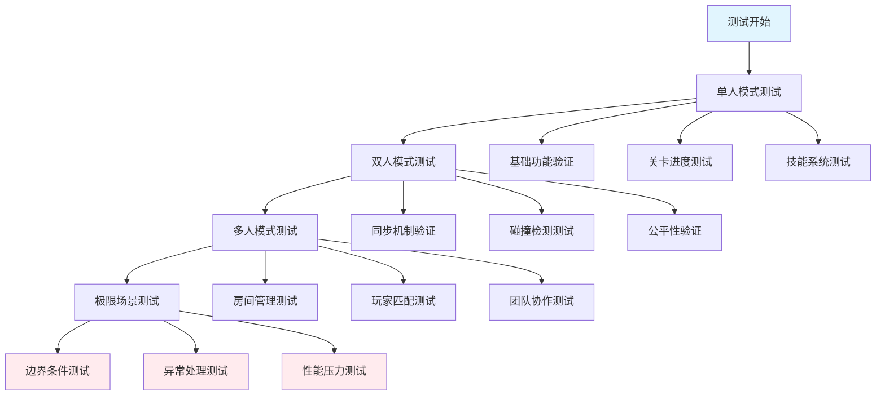

### 6.2 性能优化测试

#### 6.2.1 客户端性能指标

| 性能指标 | 目标值 | 测试方法 | 优化方案 |
|----------|--------|----------|----------|
| 帧率(FPS) | ≥60 | 性能监控工具 | 减少DOM操作,优化渲染 |
| 内存使用 | <200MB | 浏览器性能分析 | 及时清理,避免内存泄漏 |
| 加载时间 | <3秒 | 网络性能测试 | 资源压缩,懒加载 |
| 包体大小 | <5MB | 构建分析工具 | 代码分割,按需加载 |

#### 6.2.2 服务端性能指标

| 指标类型 | 目标值 | 监控方式 | 告警阈值 |
|----------|--------|----------|----------|
| 响应时间 | <100ms | APM监控 | >200ms |
| QPS处理能力 | >1000 | 压力测试 | <500 |
| 错误率 | <0.1% | 日志监控 | >1% |
| 可用性 | >99.9% | 健康检查 | <99% |