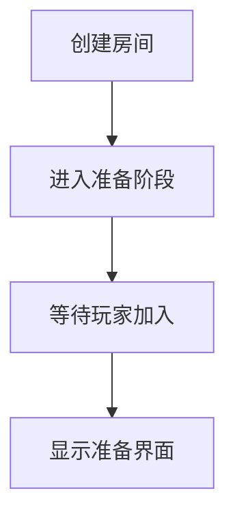
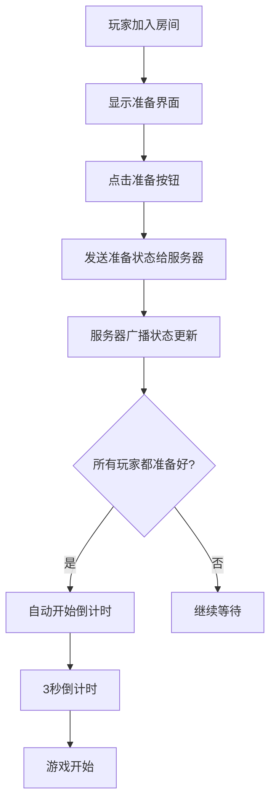
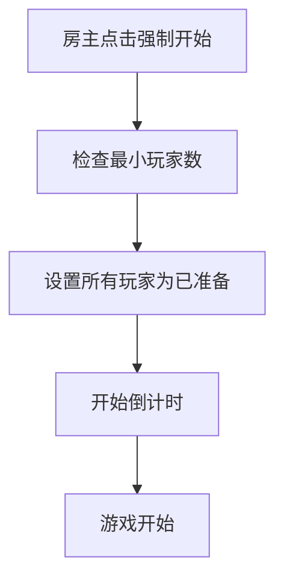

# 🎮 多人对战准备系统实现总结

## 📋 功能概述

实现了完整的多人对战准备系统，解决了以下问题：
- ✅ 第一个创建房间的用户无法正常开始游戏
- ✅ 第二个进入房间的用户直接开始游戏
- ✅ 缺少准备确认机制
- ✅ 缺少倒计时开始机制

## 🚀 新增功能

### 1. 准备阶段界面
- 📊 显示所有玩家的准备状态
- 🎯 个人准备/取消准备按钮
- 👥 实时显示已准备玩家数量
- 🎨 直观的准备状态指示器

### 2. 倒计时系统
- ⏰ 3秒倒计时动画
- 📢 全房间同步倒计时
- 🎬 平滑的状态过渡

### 3. 房主权限
- 👑 强制开始游戏功能
- 🔧 房主专用控制按钮
- ⚡ 绕过准备状态直接开始

## 🏗️ 技术实现

### 1. 前端状态管理 (multiplayerStore.js)

#### 新增状态字段
```javascript
gameSession: {
  status: 'waiting' | 'countdown' | 'playing', // 新增countdown状态
  readyPlayers: [], // 已准备玩家ID列表
  countdownValue: 0 // 倒计时数值
}
```

#### 新增计算属性
```javascript
allPlayersReady: computed(() => {
  // 检查是否所有玩家都已准备
})

isPlayerReady: computed(() => {
  // 检查当前玩家是否已准备
})
```

#### 新增方法
```javascript
togglePlayerReady() // 切换准备状态
setPlayerReady(playerId, ready) // 设置玩家准备状态
startCountdown() // 开始倒计时
resetReady() // 重置准备状态
```

### 2. 游戏组件 (MultiplayerGame.vue)

#### 准备界面
```vue
<!-- 准备阶段界面 -->
<div v-if="gameSession.status === 'waiting'" class="prepare-overlay">
  <!-- 玩家准备状态列表 -->
  <!-- 准备/取消准备按钮 -->
  <!-- 房主强制开始按钮 -->
</div>
```

#### 倒计时界面
```vue
<!-- 倒计时阶段 -->
<div v-if="gameSession.status === 'countdown'" class="countdown-overlay">
  <div class="countdown-number animate-pulse">
    {{ gameSession.countdownValue || '开始!' }}
  </div>
</div>
```

#### 状态监听
```javascript
watch(
  () => gameSession.value.status,
  (newStatus) => {
    if (newStatus === 'playing') {
      startGameLoop() // 游戏状态变为playing时启动游戏
    }
  }
)
```

### 3. 服务器端 (server.js)

#### 房间数据结构扩展
```javascript
const room = {
  // ... 原有字段
  readyPlayers: [], // 新增：已准备玩家列表
  status: 'waiting' // 扩展状态：waiting, countdown, playing
}
```

#### 准备系统方法
```javascript
setPlayerReady(playerSocketId, ready) // 设置玩家准备状态
startGameCountdown(roomId) // 开始游戏倒计时
startGame(roomId) // 开始游戏
forceStartGame(hostSocketId, roomId) // 房主强制开始
```

#### Socket事件处理
```javascript
socket.on('player_ready', ({ ready }) => {
  // 处理玩家准备状态变更
})

socket.on('force_start_game', ({ roomId }) => {
  // 处理房主强制开始
})
```

### 4. Socket通信 (socketService.js)

#### 新增事件处理
```javascript
// 准备状态变化
socket.on('player_ready_changed', (data) => {
  // 更新房间和准备状态
})

// 倒计时开始
socket.on('game_countdown_start', (data) => {
  // 开始倒计时动画
})

// 倒计时进行
socket.on('game_countdown_tick', (data) => {
  // 更新倒计时数值
})

// 游戏开始
socket.on('game_started', (data) => {
  // 切换到游戏状态
})
```

## 🎯 游戏流程

### 1. 房间创建流程


### 2. 准备确认流程


### 3. 强制开始流程


## 🎨 UI/UX 改进

### 1. 视觉设计
- 🎨 准备状态用绿色/灰色区分
- 👤 玩家头像圆形显示
- ✨ 按钮悬停动画效果
- 📱 响应式布局适配

### 2. 用户体验
- 🔄 实时状态同步
- 💬 清晰的提示信息
- ⏱️ 动态倒计时显示
- 🎵 状态过渡动画

### 3. 样式增强
```css
.ready-btn:hover {
  transform: translateY(-2px);
  box-shadow: 0 4px 12px rgba(0, 0, 0, 0.3);
}

.countdown-number {
  text-shadow: 0 0 20px rgba(255, 255, 255, 0.8);
  animation: countdown-pulse 1s ease-in-out infinite;
}
```

## 🧪 测试场景

### 1. 基本流程测试
- ✅ 单人创建房间并准备
- ✅ 多人加入房间并依次准备
- ✅ 所有人准备后自动倒计时
- ✅ 倒计时结束后游戏开始

### 2. 边界情况测试
- ✅ 玩家中途离开房间
- ✅ 房主强制开始游戏
- ✅ 网络断开重连
- ✅ 准备状态同步

### 3. 用户交互测试
- ✅ 准备/取消准备操作
- ✅ 房主权限验证
- ✅ 界面状态切换
- ✅ 错误提示显示

## 🔧 部署说明

### 1. 启动服务
```bash
# 启动后端服务器
cd server && npm start

# 启动前端服务器
npm run dev
```

### 2. 测试步骤
1. 打开多个浏览器标签页
2. 创建房间
3. 其他玩家加入房间
4. 测试准备系统
5. 验证倒计时和游戏开始

### 3. 注意事项
- 确保WebSocket连接正常
- 检查浏览器控制台日志
- 验证准备状态同步
- 测试房主权限功能

## 🎉 完成状态

- ✅ 准备系统完全实现
- ✅ 倒计时机制正常工作
- ✅ 房主强制开始功能
- ✅ 实时状态同步
- ✅ 用户界面优化
- ✅ 错误处理完善

## 🚀 下一步优化

1. **音效增强**: 添加准备提示音和倒计时音效
2. **动画优化**: 更丰富的状态切换动画
3. **AI准备**: 支持AI玩家自动准备
4. **准备超时**: 添加准备阶段超时机制
5. **统计数据**: 记录准备时间等数据

---

现在多人对战准备系统已经完全实现，玩家可以在房间中进行准备确认，系统会在所有玩家准备完毕后自动开始3秒倒计时，然后正式开始游戏！🎮